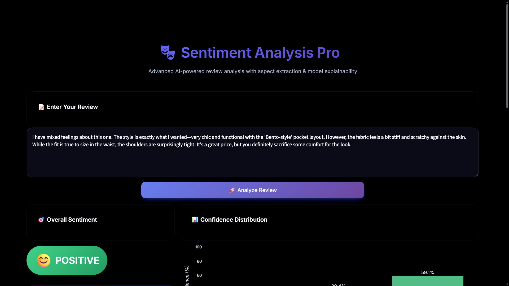
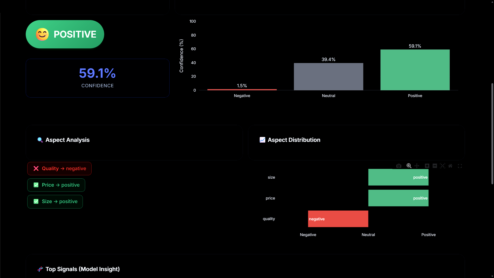
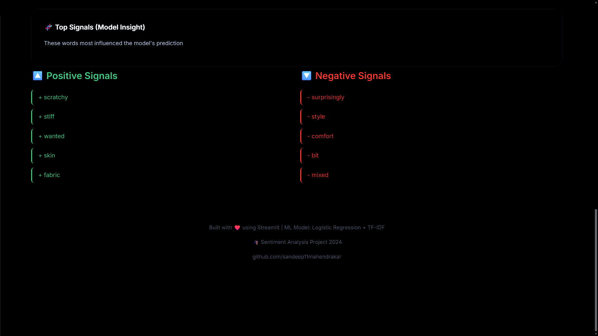

# 🎭 Multi-Aspect Sentiment Analysis

A complete machine learning system that analyzes product reviews, predicts sentiment, and extracts aspect-level insights.

---

## 📌 Problem Statement

Companies receive thousands of customer reviews daily but struggle to:

- Understand *why* customers are satisfied or dissatisfied  
- Identify which product aspects need improvement  
- Extract actionable insights from unstructured text  

---

## 💡 Solution

This project builds an end-to-end sentiment analysis system that:

- Predicts overall sentiment (positive, neutral, negative)  
- Extracts aspect-based sentiment (quality, price, size, shipping)  
- Highlights key words influencing predictions  
- Provides an interactive web interface for real-time analysis  

---

## ⚙️ Tech Stack

- **Language:** Python  
- **Machine Learning:** scikit-learn  
- **NLP:** NLTK  
- **Vectorization:** TF-IDF  
- **Explainability:** LIME  
- **Frontend:** Streamlit  

---

## 🧠 Models Used

- Logistic Regression (Best Model)  
- Naive Bayes  
- Random Forest  
- (Optional) LSTM  

---

## 📊 Results

| Model | Accuracy |
|------|--------|
| Logistic Regression | ~85% |
| Naive Bayes | ~82% |
| Random Forest | ~83% |

---

## 🔍 Key Features

- ✔ Multi-model comparison  
- ✔ Aspect-based sentiment analysis  
- ✔ Model explainability (LIME)  
- ✔ Batch review processing  
- ✔ Interactive Streamlit dashboard  

---

## 🖥️ Demo





---

## 📁 Project Structure

sentiment-analysis-project/
│
├── data/
├── notebooks/
├── src/
├── models/
├── results/
├── apps/
├── requirements.txt
└── README.md

````

---

## 🚀 How to Run

```bash
git clone https://github.com/yourusername/sentiment-analysis-project.git
cd sentiment-analysis-project

python -m venv venv
venv\Scripts\activate

pip install -r requirements.txt

cd apps
streamlit run app.py
````

---

## 📊 Dataset

* Women's E-commerce Reviews Dataset
* Source: Kaggle 

---

## 🔍 Insights

* Product quality strongly influences sentiment
* Size inconsistency is a major negative factor
* Shipping delays significantly impact user satisfaction
* Mixed reviews reveal limitations of traditional models

---

## 🎓 What I Learned

* End-to-end ML pipeline design
* Feature engineering using TF-IDF
* Model comparison and evaluation
* Explainable AI using LIME
* Deploying ML models with Streamlit

---

## 🔮 Future Improvements

* Deep learning (BERT fine-tuning)
* Sarcasm detection
* Multi-language support
* Cloud deployment

---

## 📬 Contact

* Name: Sandeep
* LinkedIn: https://www.linkedin.com/in/sandeep-mahindrakar-336b972b9
* GitHub: https://github.com/sandeep11mahendrakar

---

⭐ If you found this useful, consider giving it a star!

```
