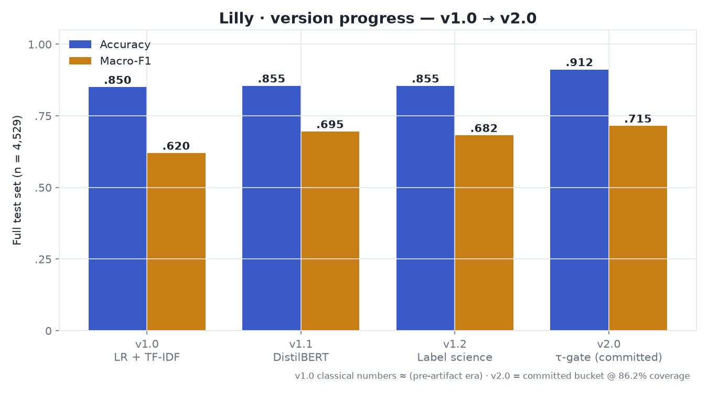
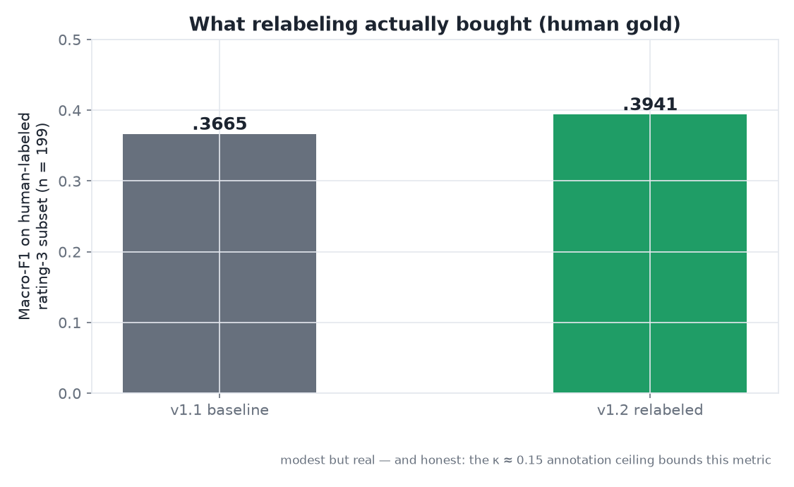
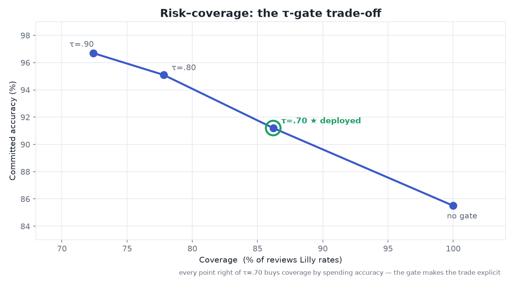
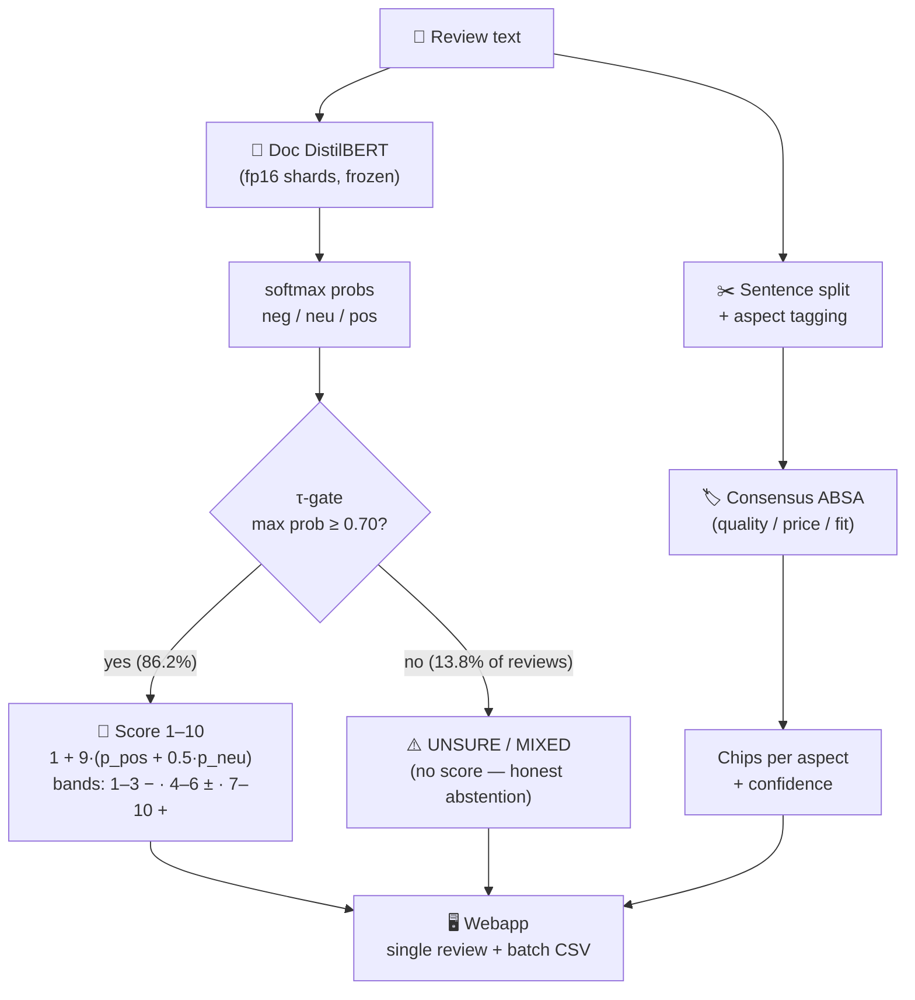

# 🌸 Lilly · Fashion Muse

> Lilly reads clothing reviews the way a stylist would — and honestly says **"UNSURE / MIXED"** when even she can't tell.

**Open weights on 🤗 Hub:**
[](https://huggingface.co/sandeep1103/lilly-fashion-muse-doc-gated)
[](https://huggingface.co/sandeep1103/lilly-fashion-muse-absa)

**Live demo:** _in progress (free-tier hosting) — run locally in 2 minutes, see below_

**License:** MIT · **Open weights** — download, modify, ship, commercialize. No gate, no API key, no strings.

---

## What Lilly Does

Most sentiment systems force every review into positive / negative. Lilly doesn't:

- **Doc-level sentiment** with a fine-tuned DistilBERT, scored on a **1–10 scale** with − / ± / + bands
- **Selective prediction:** below confidence **τ = 0.70** Lilly **abstains** (`UNSURE / MIXED`) instead of guessing
- **Aspect-based sentiment** (quality / price / fit) via a consensus-filtered ABSA model
- **Batch CSV → scored CSV:** sorted by score, unsure rows sectioned at the bottom, summary dashboard included
- Trained on women's e-commerce reviews, but reads **any** product review — menswear included

```python
# anyone can use Lilly in 5 lines — the weights are public
import torch, glob
from transformers import AutoConfig, AutoModelForSequenceClassification, AutoTokenizer

state = {}
for p in sorted(glob.glob("fp16_shard_*.pt")):   # after snapshot_download
    state.update(torch.load(p, map_location="cpu"))
model = AutoModelForSequenceClassification.from_config(AutoConfig.from_pretrained("."))
model.load_state_dict(state); model.float().eval()
tok = AutoTokenizer.from_pretrained(".")
# -> probs = softmax(model(**tok(["beautiful dress, perfect fit"], return_tensors="pt")).logits)
```

---

## The Story: v1.0 → v2.0, step by step

This project never chased a leaderboard. Each version fixed a **specific, measured flaw** of the previous one.

### v1.0 — Classical baseline (LR + TF-IDF)
- Logistic Regression over TF-IDF n-grams: **≈ .85 accuracy**, macro-F1 ≈ .62
- **Flaw discovered:** it predicted *what* a review scored, never *why* — and collapsed on long, contrast-heavy reviews ("great fabric BUT runs small").

### v1.1 — Transformer upgrade (DistilBERT)
- Fine-tuned `distilbert-base-uncased` on raw review text (max_len 128): **.855 acc / .695 macro-F1** on the full test (n = 4,529)
- Class-weighted and higher-LR variants were tried and **honestly rejected** (no macro-F1 gain)
- **Flaw discovered:** error analysis showed 21% of confident-wrong predictions sat above .8 confidence — the model lied fluently. And the *labels themselves* were suspect.



### v1.2 — Label science (the part most projects skip)
- **E7A:** humans labeled 199 rating-3 ("neutral") reviews → only **28% were actually neutral**; intra-annotator **κ ≈ 0.15** proved the annotation task itself is near-chance on this dataset
- **Path A:** conservative relabel (825/2,823 rating-3 rows) + retrain → human-gold macro-F1 **.3665 → .3941** (modest but real)
- **Path B:** built a **consensus ABSA** model (quality/price/fit) trained only on doc+sentence-agreed pairs, dropping noisy shipping aspects entirely



### v2.0 — The gate becomes the product (confidence gating + open weights)
- **E8:** temperature-scaled calibration + risk–coverage analysis → operating point **τ = 0.70: 91.2% accuracy at 86.2% coverage**
- Reviews below τ are labeled **UNSURE / MIXED** — Lilly abstains instead of guessing
- 1–10 score scale with −/±/+ bands, FastAPI webapp, fp16-shard open weights on the HF Hub



**The thesis of v2:** on a dataset with a κ ≈ 0.15 annotation ceiling, chasing raw accuracy is a dead end. *Knowing when not to answer* is worth more than a forced answer — 91.2% @ 86% coverage beats 85.5% @ 100% for any real triage workflow.

---

## Architecture



---

## The Honest Numbers (held-out, n = 4,529)

| Operating point | Coverage | Committed acc | Committed macroF1 | Abstains |
|-----------------|----------|---------------|-------------------|----------|
| τ = 0.70 (**deployed**) | 86.2% | **91.2%** | .715 | 13.8% |
| τ = 0.80 | 77.8% | 95.1% | .690 | 22.2% |
| No gate (full test) | 100% | 85.5% | .695 | — |

- Labels are **weak** (derived from star ratings); intra-annotator κ ≈ 0.15 caps what "accuracy" can even mean here
- The abstained bucket is dominated by genuinely ambiguous mixed reviews ("beautiful pattern but runs extremely small")
- **The gate is the product.** Forcing a prediction on ambiguous text is a lie; abstaining is a feature.

---

## Use Cases

| Who | What Lilly does for them |
|-----|--------------------------|
| **E-commerce support teams** | Triage thousands of reviews in minutes — batch CSV in, sorted scored CSV out; the 14% UNSURE bucket goes to humans instead of polluting dashboards |
| **Product / QC managers** | Aspect chips (quality / price / fit) answer *"which feature is failing?"* — not just *"are customers unhappy?"* |
| **Market researchers** | The 1–10 scale + confidence makes review scores comparable and honest; mixed reviews are flagged, not averaged away |
| **ML engineers** | A reference implementation of **selective prediction** (calibration → risk–coverage → τ-gate) on open weights — clone the approach, not just the model |
| **Builders / hackers** | Open weights, fp16 shards + loading snippet above — fine-tune further, quantize, embed in your own stack, commercial use included (MIT) |

---

## Run Locally

```bash
git clone https://github.com/sandeep11mahendrakar/sentiment-analysis-project.git
cd sentiment-analysis-project

python -m venv venv
venv\Scripts\activate

pip install -r requirements.txt

uvicorn apps.webapp.backend.main:app --host 0.0.0.0 --port 7860
```

Open http://localhost:7860 — two tabs: **Single Review** and **Batch CSV** (max 5,000 rows per batch). First boot loads ~540 MB of weights from the Hub (or set `DOC_MODEL_ID` / `ABSA_MODEL_ID` to your own copies).

Tests: `python -m pytest apps\webapp\tests`

---

## Dataset

Women's E-commerce Clothing Reviews (Kaggle) — ~23k real customer reviews.

## Project Structure

```
apps/webapp/        FastAPI backend + vanilla JS frontend + Dockerfile
src/                training / evaluation / experiment scripts
models/deploy/      frozen fp16 deploy weights (Lilly doc + absa)
results/            metrics, gating analysis, error analysis
docs/assets/        README charts · docs/superpowers/ design records
PROJECT_MEMORY.md   full engineering log / source of truth
```

---

## What We Completely Missed (the honest list)

- **Multilingual reviews** — English only; Lilly is monolingual by training data
- **Sarcasm & implicit sentiment** — "great, another return" reads positive to her
- **Learned abstention** — the τ-gate is a fixed threshold, not a learned cost-sensitive policy
- **Per-product / per-week trend dashboards** — the batch summary is point-in-time; no longitudinal view
- **Human-in-the-loop at scale** — relabeling was a one-off (825 rows), not a continuous active-learning loop
- **Streaming large batches** — 5,000-row cap; no chunked upload for 100k-row files
- **Model registry & CI** — weights are versioned by hand on the Hub; no automated eval-gate on retrain
- **Monitoring / drift detection** — the deployed app logs nothing; no live accuracy tracking
- **Bigger human gold sets** — n = 199 (doc) and n = 91 (ABSA) are directional, not definitive
- **Explainability** — attribution was deliberately dropped; confidence + gating are the honesty signals, but "why did Lilly score this 4?" has no answer yet

## Limitations (read before trusting any number)

- Weak-label provenance: stars → labels, not human sentiment annotation
- Annotation ceiling κ ≈ 0.15 — absolute accuracy must be read against it
- Committed bucket skews positive as τ rises
- ABSA gold-set performance is directional only (n = 91)
- Shipping aspects intentionally excluded from ABSA (too noisy to be honest)

---

## Contact

**Sandeep Mahendrakar**
[LinkedIn](https://www.linkedin.com/in/sandeep-mahindrakar-336b972b9) · [GitHub](https://github.com/sandeep11mahendrakar)

---

⭐ If Lilly helped you, a star on the repo and a like on the [model](https://huggingface.co/sandeep1103/lilly-fashion-muse-doc-gated) pages mean a lot.
